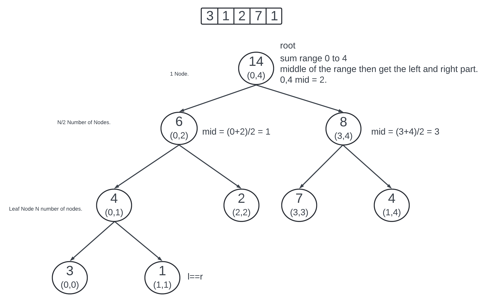
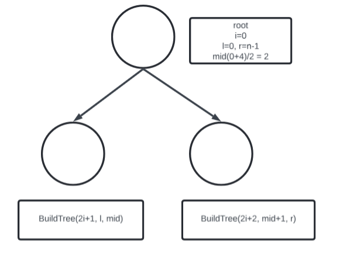
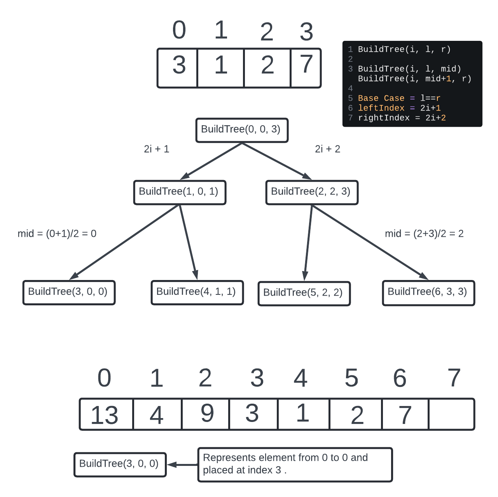

### Segment Tree.

Given an array requirement to find the sum of a range.

Ind = 0 1 2 3 4 5 6
arr = 3 1 2 7 5 6 3

sum(1,4) = 1+2+7+5
sum(2,5) = 2+7+5+6

Traversing the array to find the range sum. Say to tal of Q queries and traversing the array n. Total O(Q*n). n = 10^6 and Q = 10^4. Not possible.  
The fundametal is like in **range** and the query can be like finding the min or max in a range or the avg in a range.



**Observations.**  
Binary Tree.  
All node has 2 children except leaf node.  
Root represents the entire array.  
Leaf node represents all the single elements.  
Other node represents arange of an array.  
Height of the tree O(log N).  
Every node the left subtree height and right subtree height will only have the difference of 1.  
It is a Balanced Binary Tree.  
Total number of nodes = N + N/2 + N/4 + .... + 1 (N = ∞) Then G.P of Sum(∞) = a/(1-r) = r common ratio.  
N/(1-1/2) = 2*N.  
Leaf Node = N.  
Other Node = N-1.

**How to make the tree in Segment Tree?**
Represent the tree as an array.  
Root index i then the left child index 2i+1 and right child index 2i+2.  
Root start at 0 index. 



SegmentTree[i] = SegmentTree[2*i+1] + SegmentTree[2*i+2]



SubTree[1] = SubTree[2i+1] + SubTree[2i+2] = 3+1 = 4. 

SubTree[2] = SubTree[2i+1] + SubTree[2i+2] = 2+7 = 9

```java
static void buildTree(i, l, r){
  // Base Case.
  if(l==r){
    segTree[i] = nums[r];
    return;
  }
  int mid = (l+r)/2;
  buildTree(2i+1, l, mid);
  buildTree(2i+2, mid+1, r);
  segTree[i] = segTree[2i+1] + segTree[2i+2];
}
```
segTree array size = leaf node N and other node N-1 = N + N - 1 = 2N - 1 = 7.  

Time = Node root to leaf and then leaf to node to fill the value = O(2*(2n)) = 0(N).
